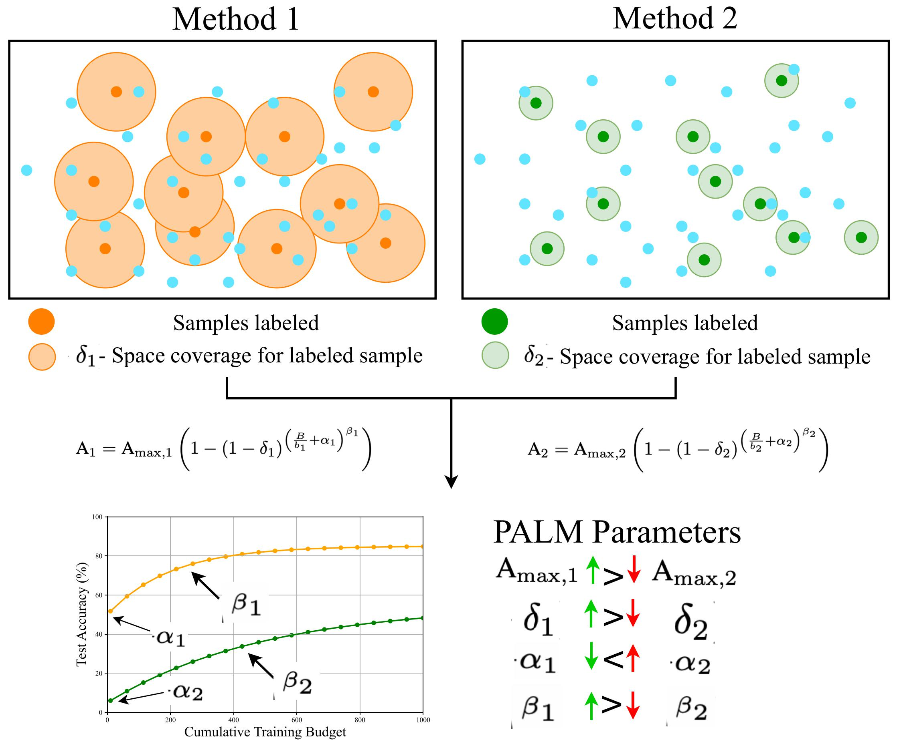
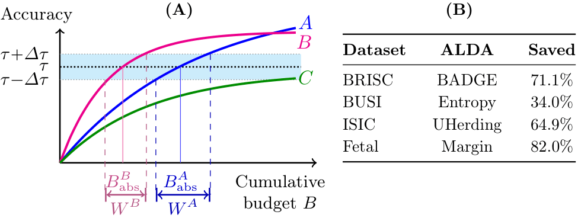

# 🌴 [ICCV25] PALM: *Performance Analysis of Active Learning Models*

This is the **official repository of “To Label or Not to Label: PALM – A Predictive Model for Evaluating Sample Efficiency in Active Learning Models”**, presented at **ICCV 2025**.

The goal of PALM is to provide a unified and interpretable mathematical model designed to **predict and analyze the behavior of Active Learning (AL) methods**.

This repository brings together three connected active-learning contributions:

1. **PALM** — a predictive model for active-learning learning curves.
2. **ALDA** — a deployment advisor that uses PALM outputs to recommend a method for a target performance level; accepted for oral presentation at the EMA4MICCAI Workshops.
3. **Mechanism-Driven Theory** — the next planned repository extension, covering computational proxies, phase analysis, and a hard-switch baseline.

<table>
<tr>
<td width="50%" valign="top">

PALM provides a **predictive description** of learning dynamics from partial observations, enabling:
- Estimation of **future performance** from early-stage results  
- **Principled comparison** across different AL strategies  
- Quantitative analysis of key factors affecting sample efficiency  

</td>
<td width="50%" valign="top" align="center">



</td>
</tr>
</table>


<div style="display: flex; justify-content: center;">
  
</div>

---

## 🏝️ The PALM Model

PALM models AL performance trajectories using four interpretable parameters:

$$
A = A_{\text{max}} \left( 1 - (1 - \delta)^{\left(\frac{B}{b} + \alpha\right)^{\beta}} \right)
$$

| Parameter | Meaning | Interpretation |
|------------|----------|----------------|
| **A** | Accuracy | Accuracy achieved by the model in the current AL episode. |
| **Aₘₐₓ** | Achievable accuracy | The asymptotic upper bound of accuracy achievable by the model. |
| **δ (delta)** | Coverage efficiency | Higher δ indicates better utilization of each labeled sample, improving data-space coverage. |
| **α (alpha)** | Initial learning efficiency | Lower α boosts initial accuracy, crucial in low-budget scenarios. |
| **β (beta)** | Scalability | Higher β increases the accuracy improvement rate as more samples are labeled. |
| **b** | Budget efficiency | Smaller `b` means more frequent updates with smaller batches, allowing smoother learning progression. |

---

## ⚙️ Usage Guide

PALM can be used in two main ways:

1. **Standalone mode:** as a separate script integrated into your AL framework.  
   Input required: cumulative budget values per episode and corresponding accuracy results.

2. **Framework mode (recommended):** as a follow-up step inside the [TypiClust framework](https://github.com/avihu111/TypiClust/tree/main) for reproducible evaluation.

---

### 🧩 Environment Installation — Case 1 (Standalone PALM)

Use this setup if you only want to run **PALM.py** for curve fitting, without the full Active Learning framework.

#### 1️⃣ Create an environment
```bash
conda create -n palm pytho=3.12 -y
conda activate palm
conda install numpy scipy matplotlib
```

### 🧩 Environment Installation — Case 2 (Framework mode)

To use PALM as a part of AL framework please refer to [USAGE_Typiclust](typiclust_original_instructions/USAGE_Typiclust.md). Note that original TypiClust uses python 3.7. If you prefere to use python 3.11, [here](Python_311_instalation_guide.md) is the additional guide. 

### ▶️ Running PALM
In both Cases, PALM.py automatically searches for .npy files in the following structure:

```
/path/to/AL/output/<DATASET>/<MODEL>/
├── <METHOD_1>_1/plot_episode_yvalues.npy
├── <METHOD_1>_2/plot_episode_yvalues.npy
├── <METHOD_2>_2/plot_episode_yvalues.npy
├── <METHOD_2>_2/plot_episode_yvalues.npy
└── ...
```
Each .npy file should be a 1D array of accuracies recorded after each Active Learning episode. The <METHOD_1> is name of your AL method and _N is the repetition under the same settings. 


**A) Fit on episode index (default mode) - Example**

```
python PALM.py \
  --base_path /path/to/output/IMAGENET50/resnet50 \
  --dataset IMAGENET50 \
  --model resnet50 \
  --method random_ff_moco_b50 \
  --num_variants 5 \
  --num_samples 15 \
  --x_mode episodes \
  --out_dir palm_fit_out \
  --plot \
  --save_csv

```

**B) Fit on cumulative-normalized budget - Example**

```
python PALM.py \
  --base_path /path/to/output/IMAGENET50/resnet50 \
  --dataset IMAGENET50 \
  --model resnet50 \
  --method random_ff_moco_b50 \
  --num_variants 5 \
  --num_samples 15 \
  --x_mode cumulative_normalized \
  --budget_size 100 \
  --out_dir palm_fit_out \
  --plot \
  --save_csv

```

### 📦 Output Files

After running `PALM.py`, the following files will be saved in the directory specified by `--out_dir`  
(default: `./palm_fit_out`):

| File | Description |
|------|--------------|
| `palm_params.json` | Fitted PALM parameters and metadata (dataset, model, method, episodes, etc.) |
| `palm_params.csv` | (Optional) CSV summary of the parameters, created if `--save_csv` is used |
| `y_avg.npy` | Averaged accuracy values across all selected runs |
| `y_fit.npy` | Fitted PALM curve values corresponding to the averaged data |
| `palm_fit.png` | Visualization of the PALM fit (generated if `--plot` is used) |

> 💡 These outputs allow you to easily reproduce, visualize, or compare fitted curves across Active Learning methods.

---

### 🚩 Common Flags

| Flag | Description |
|------|--------------|
| `--base_path` | Path to the folder containing run subdirectories (e.g. `output/CIFAR10/resnet50/`) |
| `--dataset` | Dataset name (for logging and output files) |
| `--model` | Model name (for logging and output files) |
| `--method` | Prefix of run folders (e.g. `typiclust_moco_b50`) |
| `--num_variants` | Number of repeated runs to average (e.g. 5 for `_1`, `_2`, `_3`, `_4`, `_5`) |
| `--num_samples` | Number of Active Learning episodes to use per run (`-1` = use all) |
| `--x_mode` | X-axis type: `episodes` (default) or `cumulative_normalized` |
| `--budget_size` | Budget per episode (only used if `x_mode=cumulative_normalized`) |
| `--out_dir` | Directory to save PALM outputs (default: `./palm_fit_out`) |
| `--plot` | Display and save the fitted PALM curve as a figure |
| `--save_csv` | Save fitted parameters to `palm_params.csv` in addition to JSON |
| `--init_A_max`, `--init_delta`, `--init_alpha`, `--init_beta` | Optional custom initial guesses for the curve-fitting procedure |
| `--alpha_lo`, `--alpha_hi`, `--beta_hi` | Bounds for fitting parameters (advanced use) |

> 🔹 Use `--help` to see the full list of options and defaults:
> ```bash
> python PALM.py --help
> ```
---

## 🩺 [Oral EMA4MICCAI Workshops 2026] ALDA: Active Learning Deployment Advisor

> *How Many Labels Are Enough? ALDA: Active Learning Deployment Advisor for Medical Image Classification*

<p align="center">
  <a href="fig_ALDA.pdf">
    
  </a>
</p>

<p align="center"><em>ALDA converts pilot learning curves into a risk-aware active-learning deployment recommendation. </em></p>

**ALDA turns early learning-curve forecasts into prospective Active Learning deployment decisions.**

Instead of asking which Active Learning method performs best after the full annotation experiment has already been completed, ALDA asks a deployment-oriented question:

> **Given a short pilot, which Active Learning strategy should we continue with, and how many labels are expected to be needed to reach the required performance?**

ALDA evaluates several candidate Active Learning strategies from partial learning trajectories and estimates:

- whether each strategy is expected to reach a required target performance;
- the annotation budget required to reach that target;
- how sensitive this budget is to uncertainty in the target;
- and which strategy provides the best trade-off between annotation cost and deployment robustness.

The workflow is:

```text
pilot Active Learning trajectories
            ↓
      PALM curve fitting
            ↓
 feasibility + annotation-cost estimation
            ↓
   deployment-risk analysis
            ↓
      ALDA recommendation
```
---

### 🔍 What ALDA estimates

For every candidate Active Learning method \(m\), ALDA fits the PALM learning curve to the early pilot results:

$$
A(B) =
A_{\max} \cdot
\left[
1 -
(1-\delta)^{
\left(
\frac{B}{b}+\alpha
\right)^\beta
}
\right],
$$

where \(B\) is the cumulative annotation budget and
\(\theta_m=\{A_{\max},\delta,\alpha,\beta\}\) are fitted from the observed pilot trajectory.

The fitted curve is then used to estimate three deployment quantities.

#### 1. Feasibility

Let \(\tau\) denote the minimum performance required for deployment.

A method is considered feasible if

$$
A_{\max}^{(m)} \geq \tau.
$$

Methods whose predicted performance ceiling lies below the target are flagged as infeasible before additional annotation resources are committed.

#### 2. Absolute annotation cost

For each feasible method, ALDA estimates the minimum number of labels required to reach the target:

$$
B_{\mathrm{abs}}^{(m)}(\tau)
=
\min
\left\{
B :
A_m(B) \geq \tau
\right\}.
$$

This converts the predicted learning curve into an interpretable deployment quantity:

> **How many expert annotations are expected to be needed?**

#### 3. Deployment window

The deployment target may not be known exactly and can change after clinical validation, expert consultation, or deployment requirements are revised.

Given an uncertainty interval

$$
\tau \pm \Delta\tau,
$$

ALDA defines the deployment window

$$
W^{(m)}
=
B_{\mathrm{abs}}^{(m)}(\tau+\Delta\tau)
-
B_{\mathrm{abs}}^{(m)}(\tau-\Delta\tau).
$$

A small \(W\) indicates that the estimated annotation requirement is relatively stable when the target changes. A large \(W\) indicates a threshold-sensitive strategy whose annotation cost may increase substantially after even a small revision of the required performance.

---

### 🎯 Risk-aware recommendation

Selecting the method with the smallest predicted annotation cost alone can be unstable when several strategies have nearly identical costs.

ALDA therefore first identifies the lowest predicted cost

$$
B_{\min}
=
\min_{m \in \mathcal{M}_{\mathrm{feas}}}
B_{\mathrm{abs}}^{(m)}(\tau),
$$

and constructs a set of cost-competitive methods

$$
\mathcal{C}_{\eta}
=
\left\{
m :
\frac{
B_{\mathrm{abs}}^{(m)}(\tau)-B_{\min}
}{
B_{\min}
}
\leq \eta
\right\},
$$

where \(\eta\) defines the tolerated relative increase in annotation cost.

Among these near-optimal methods, ALDA recommends the strategy with the smallest deployment window:

$$
m^*
=
\arg\min_{m\in\mathcal{C}_{\eta}}
W^{(m)}.
$$

Thus:

- **\(B_{\mathrm{abs}}\)** determines which methods are annotation-efficient;
- **\(W\)** determines which cost-competitive method is most robust to changes in the deployment target.

ALDA therefore does not simply select the method with the highest final performance or the smallest nominal label budget. It provides a **risk-aware deployment recommendation**.

---

### 📥 What ALDA needs

The recommended interface consumes one output directory from `PALM.py` for each candidate method.

Each PALM directory should contain:

| File | Produced by PALM | Used by ALDA |
|------|------------------|--------------|
| `palm_params.json` | PALM fit metadata, dataset, method, and acquisition budget | Identifies and aligns candidate methods |
| `y_avg.npy` | Mean observed learning trajectory across repeated runs | Used for ALDA curve fitting and deployment estimation |

Candidate methods should be evaluated using the same:

- dataset;
- train/test split;
- model and training protocol;
- evaluation metric;
- experimental setting.

Different acquisition batch sizes can be used. ALDA performs the comparison in terms of **cumulative labeled samples**.

---

### ⚙️ Installation

The ALDA core requires only Python, NumPy, and SciPy.

If you are using this full repository, install all necessary PALM dependencies from above.

---

### 🚀 Quick Start

#### 1. Run the candidate Active Learning methods

Each run should produce `plot_episode_yvalues.npy` using the output structure already supported by `PALM.py`:

```text
results/CIFAR10/resnet18/
├── typiclust_1/plot_episode_yvalues.npy
├── typiclust_2/plot_episode_yvalues.npy
├── coreset_1/plot_episode_yvalues.npy
└── coreset_2/plot_episode_yvalues.npy
```
At least four unique trajectory points are required for fitting. In practice, larger pilot prefixes provide more reliable extrapolation; the ALDA experiments evaluate pilot fractions between 10% and 30%.

#### 2. Fit PALM for every candidate method

Create a separate PALM output directory for each strategy.

Set `--budget_size` to the number of samples acquired during one Active Learning episode.

```bash
python PALM.py \
  --base_path results/CIFAR10/resnet18 \
  --dataset CIFAR10 \
  --model resnet18 \
  --method typiclust \
  --num_variants 2 \
  --budget_size 100 \
  --out_dir palm_outputs/typiclust

python PALM.py \
  --base_path results/CIFAR10/resnet18 \
  --dataset CIFAR10 \
  --model resnet18 \
  --method coreset \
  --num_variants 2 \
  --budget_size 100 \
  --out_dir palm_outputs/coreset
```

#### 3. Ask ALDA for a deployment recommendation

Provide the PALM output directories for the candidate methods and specify the required performance target.

For example, when scores are stored as percentages, `--target 80` corresponds to a target accuracy of 80%.

```bash
python deep-al/tools/alda/advisor.py \
  --palm-output palm_outputs/typiclust palm_outputs/coreset \
  --output-dir alda_outputs \
  --target 80
```

The default target uncertainty is 5 percentage points (`--delta-target 5`) for percentage scores and 0.05 for fractional scores. The default cost non-inferiority band is `--eta 0.05`, meaning that a method may require up to 5% more labels than the minimum-cost method and still be considered cost-competitive.

The score and target must use the same scale:

```text
scores: 0–100  → target: 80
scores: 0–1    → target: 0.80
```

---

### 📦 ALDA Outputs

ALDA stores the deployment analysis in the directory specified by `--output-dir`.

| File | Contents |
|------|----------|
| `alda_fits.csv` | Method-level PALM parameters, RMSE, feasibility, `B_abs`, deployment window `W`, `W / B_abs`, and cost-competitive membership (`C_eta`) |
| `alda_advice.csv` | Target, target uncertainty, `eta`, selected method, `selected_B_abs`, `selected_W`, and decision reason |

These outputs allow the candidate strategies and their predicted deployment requirements to be inspected before committing the remaining annotation budget.

---

### 🔬 Advising from Partial Trajectories

ALDA is designed for **prospective method selection**.

To simulate a deployment decision made before the full Active Learning experiment is complete, only the first \(N\) observations from each trajectory can be used:

```bash
python deep-al/tools/alda/advisor.py \
  --palm-output palm_outputs/typiclust palm_outputs/coreset \
  --output-dir alda_early_outputs \
  --target 80 \
  --max-points 8
```

This corresponds to the practical setting in which candidate methods are evaluated during a short pilot and ALDA is used to decide which strategy should receive the remaining annotation budget.

At least four unique trajectory points are required for fitting.

Early learning-curve predictions are estimates rather than guarantees. Recommendations should therefore be interpreted together with curve-fit quality, deployment sensitivity, and domain-specific validation.

---

### 🧪 Pilot-Based Deployment

The intended ALDA workflow is:

1. Run several candidate Active Learning strategies during a short pilot.
2. Fit PALM to the partial trajectory of each method.
3. Estimate whether each candidate can reach the required target.
4. Estimate its required annotation cost \(B_{\mathrm{abs}}\).
5. Evaluate sensitivity to target uncertainty using \(W\).
6. Identify methods with near-optimal annotation cost.
7. Recommend the most robust strategy among them.
8. Continue annotation using the selected Active Learning method.

In our medical-imaging experiments, ALDA identifies label-efficient strategies from approximately **15–30% of the intended annotation trajectory**, with recommendations typically stabilizing as additional pilot observations become available.

---

### 📄 Optional CSV Interface

The standard workflow is:

```text
Active Learning runs → PALM → ALDA
```

However, ALDA can also analyze learning curves generated by an external Active Learning framework.

Use `--input` with a CSV containing:

```text
dataset,method,cumulative_budget,score
```

For example:

```bash
python deep-al/tools/alda/advisor.py \
  --input external_curves.csv \
  --output-dir alda_outputs \
  --target 0.80
```

Scores may be represented either as proportions (`0–1`) or percentages (`0–100`), but the target must use the same scale.


### ✅ Validation

A synthetic smoke test is available under `deep-al/tools`:

```bash
python alda/tests/test_advisor.py
```

The test covers both:

```text
PALM output → ALDA
```

and the optional external CSV interface.

---

## 🧭 Coming Next: Mechanism-Driven Theory

The next repository extension will add the implementation accompanying *A Mechanism-Driven Theory of Phase Transitions in Active Learning* (ECCV 2026), including operational proxies, phase-transition analysis, segmented-regression transition detection, and the proxy-derived switching baseline.

This component is not implemented in the current ALDA release.

---

## 📚 Citing this Repository

If you find **PALM** useful in your research, please consider citing our ICCV 2025 paper and the repositories our work builds upon.

This repository builds on concepts and frameworks designed by [TypiClust](https://github.com/avihu111/TypiClust), [SCAN](https://github.com/wvangansbeke/Unsupervised-Classification), and [Deep-AL](https://github.com/decile-team/deep-active-learning). Please consider citing their work along with ours.

---

### 🏝️ PALM (ICCV 2025)

```
@article{machnio2025label,
  title={To Label or Not to Label: PALM--A Predictive Model for Evaluating Sample Efficiency in Active Learning Models},
  author={Machnio, Julia and Nielsen, Mads and Ghazi, Mostafa Mehdipour},
  journal={Proceedings of the IEEE/CVF International Conference on Computer Vision (ICCV)},
  year={2025}
}
```


### 🩺 ALDA (EMA4MICCAI Workshops 2026)

```bibtex
@inproceedings{machnio2026alda,
  title={How Many Labels Are Enough? ALDA: Active Learning Deployment Advisor for Medical Image Classification},
  author={Machnio, Julia and Nielsen, Mads and Ghazi, Mostafa Mehdipour},
  booktitle={EMA4MICCAI Workshop at MICCAI},
  year={2026}
}
```

### 🧭 Mechanism-Driven Theory (ECCV 2026)

```bibtex
@article{machnio2026mechanism,
  title={A Mechanism-Driven Theory of Phase Transitions in Active Learning},
  author={Machnio, Julia and Nielsen, Mads and Ghazi, Mostafa Mehdipour},
  journal={arXiv preprint arXiv:2607.00144},
  year={2026}
}
```

### 📘 Related References

```
@article{hacohen2022active,
  title={Active learning on a budget: Opposite strategies suit high and low budgets},
  author={Hacohen, Guy and Dekel, Avihu and Weinshall, Daphna},
  journal={arXiv preprint arXiv:2202.02794},
  year={2022}
}

@article{yehudaActiveLearningCovering2022,
  title = {Active {{Learning Through}} a {{Covering Lens}}},
  author = {Yehuda, Ofer and Dekel, Avihu and Hacohen, Guy and Weinshall, Daphna},
  journal={arXiv preprint arXiv:2205.11320},
  year={2022}
}

@article{mishal2024dcom,
      title={DCoM: Active Learning for All Learners}, 
      author={Mishal, Inbal and Weinshall, Daphna},
      journal={arXiv preprint arXiv:2407.01804},
      year={2024}
}

@inproceedings{vangansbeke2020scan,
  title={Scan: Learning to classify images without labels},
  author={Van Gansbeke, Wouter and Vandenhende, Simon and Georgoulis, Stamatios and Proesmans, Marc and Van Gool, Luc},
  booktitle={Proceedings of the European Conference on Computer Vision},
  year={2020}
}

@article{Chandra2021DeepAL,
    Author = {Akshay L Chandra and Vineeth N Balasubramanian},
    Title = {Deep Active Learning Toolkit for Image Classification in PyTorch},
    Journal = {https://github.com/acl21/deep-active-learning-pytorch},
    Year = {2021}
}

@article{Munjal2020TowardsRA,
  title={Towards Robust and Reproducible Active Learning Using Neural Networks},
  author={Prateek Munjal and N. Hayat and Munawar Hayat and J. Sourati and S. Khan},
  journal={ArXiv},
  year={2020},
  volume={abs/2002.09564}
}
```

## License
This toolkit and PALM is released under the MIT license. Please see the [LICENSE](LICENSE) file for more information.
